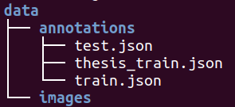

# Vehicles Detection Tracking Speed Estimation using pytorch and MMDetection

This is the thesis conducted while we are studying in Ho Chi Minh City University of Technology, Vietnam. In this project, we apply Deep Learning using Pytorch framework and based on MMDetection to do vehicles detection, tracking and speed estimation. The dataset is collected at the overpass in Ho Chi Minh City, Vietnam and labels by our team. You can find more information of our work in [Project summary](https://drive.google.com/file/d/1Ke5uFPAcKx4uvgqOWkhXF8xmB1Yqza_d/view?usp=sharing). 

**Our main work is summarized as following**
- We divided the work into four parts for development: Detection part, tracking part, speed estimation part and dataset, in which we only focus on reading papers, perceive those ideas and apply them to improve the results.
- For object detection, we only research and apply various network architecture such as RetinaNet, Faster R-CNN as well as recent techniques for object detection including ATSS, data Augmentation, Focal KL Loss, etc. to push the accuracy.
- For tracking and speed estimation, we focus on applying IOU tracker and modify it for stable tracking results; applying formular V=S/t for speed estimation. We mainly evaluate the tracking result by human visualization because of the limitation of label for those parts.
- Make new dataset: The main problem we encounter is GPU resources for train Deep Learning Network. If we utilized the existed dataset which is extremely large and heavy, we could not do on that. Hence, we need a new dataset which is liter and apply transfer learning technique to reach our target. The details of our dataset is in the later section.

**Structure of this README**
- Installation
- Dataset preparation
- Train
- Test
- Result
- Citation

## Installation
#### Create conda env
```bash
conda create -n vdts python=3.7 -y
conda activate vdts
```
#### Install Pytorch, Torchvision and mmdetection
```bash 
conda install pytorch=1.5 torchvision -c pytorch
pip install "git+https://github.com/open-mmlab/cocoapi.git#subdirectory=pycocotools"
pip install git+https://github.com/open-mmlab/mmdetection.git@v2.2.0
pip install mmcv==0.6.2
```
**Note**:  Make sure that your compilation CUDA version and runtime CUDA version match. You can check the supported CUDA version for precompiled packages on the [Pytorch website](https://pytorch.org/)

#### Install other requirements
```bash
pip install git+https://github.com/thuyngch/cvut
pip install future tensorboard
```

<!-- #### Install ttdet as package
```bash
pip install -e ./
``` -->


## Dataset preparation
- Download dataset from Google Drive [Link](https://drive.google.com/file/d/1EcfzRi7bHdZDAwIDBdBtyAIEsWmytqUa/view?usp=sharing) and unzip it.
- The data after extracted should following the following structure: <br>
 <br>
- Make symblic link to the dataset you just downloaded from project directory:
```bash
ln -s <PATH TO DATASET> data
```
**For Example**, my dataset named `data` is located at `/home/tuan/Desktop`, I do the following command: <br> <br>


The result in the image above is that I make the symblic link name `data` to the folder containing dataset.
<br>
## Train
- Run the following command in bash shell:
```bash
#!/usr/bin/env bash
set -e
CFG="atss_r50_fpn_1x_street"                                        # file name of config file
WORKDIR="../TS/checkpoints/transfer_weight/${CFG}"                  # directory for saving checkpoints during training
CONFIG="configs/street/${CFG}.py"                                   # path to your config file
GPUS=2                                                              # number of GPU while training
LOAD_FROM="../TS/checkpoints/pretrained/atss_r50_fpn_1x_coco.pth"   # Pretrain weight from COCO dataset
export CUDA_VISIBLE_DEVICES=0,1
bash tools/dist_train.sh $CONFIG $GPUS --work-dir $WORKDIR  --options DATA_ROOT=$DATA_ROOT --load_from $LOAD_FROM
```
- In the above example, config file is `configs/street/atss_r50_fpn_1x_street.py`, pretrained weight is `atss_r50_fpn_1x_coco.pth` and saved at `../TS/checkpoints/pretrained`. Checkpoints will save under `../TS/checkpoints/transfer_weight/atss_r50_fpn_1x_street`.

- NOTE: The pretrained weight from COCO is download at [MMDetection repo](https://github.com/open-mmlab/mmdetection), following section will give the specific link. 


## Test 
- Run the following command in bash shell:

```bash
#!/usr/bin/env bash
set -e
export PYTHONPATH="$(dirname $0)/..":$PYTHONPATH

CONFIG_FILE="atss_r18_fpn_2x_street"                            # file name of config file
WORKDIR="../TS/checkpoints/transfer_weight/${CONFIG_FILE}"      # directory of checkpoints
CONFIG="configs/street/${CONFIG_FILE}.py"                       # path to your config file
CHECKPOINT="${WORKDIR}/epoch_12.pth"                            # checkpoint file, in this case `epoch_12.pth`
RESULT="${WORKDIR}/epoch_12.pkl"

GPUS=2
export CUDA_VISIBLE_DEVICES=0,1

python -m torch.distributed.launch --nproc_per_node=$GPUS --master_port=$((RANDOM + 10000)) \
    tools/test.py $CONFIG $CHECKPOINT --launcher pytorch --out $RESULT --eval bbox
```
